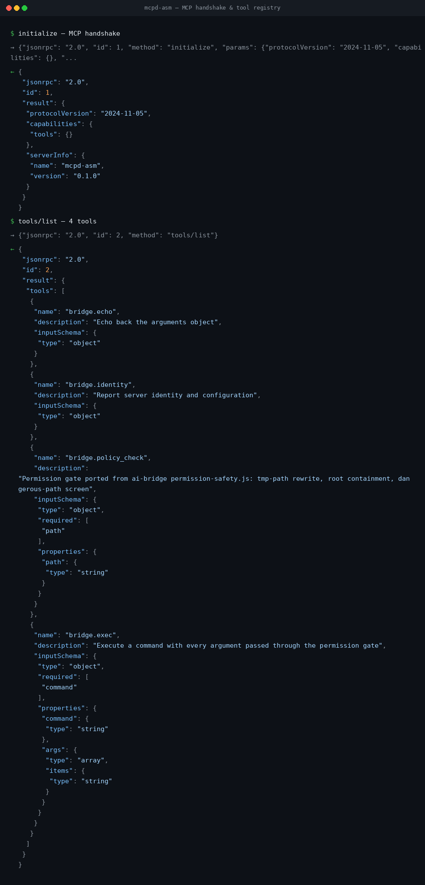
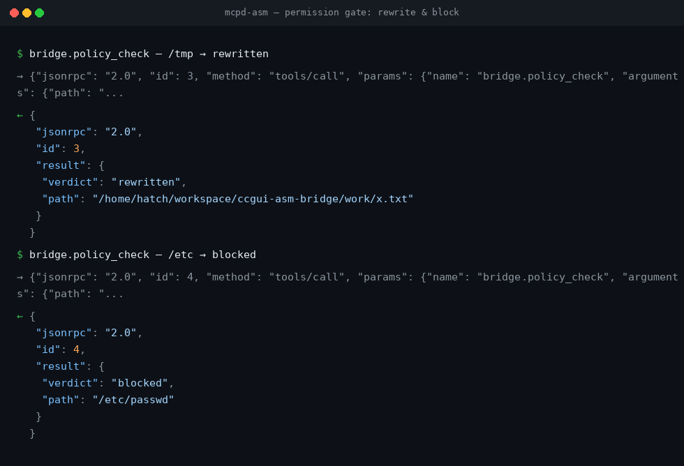
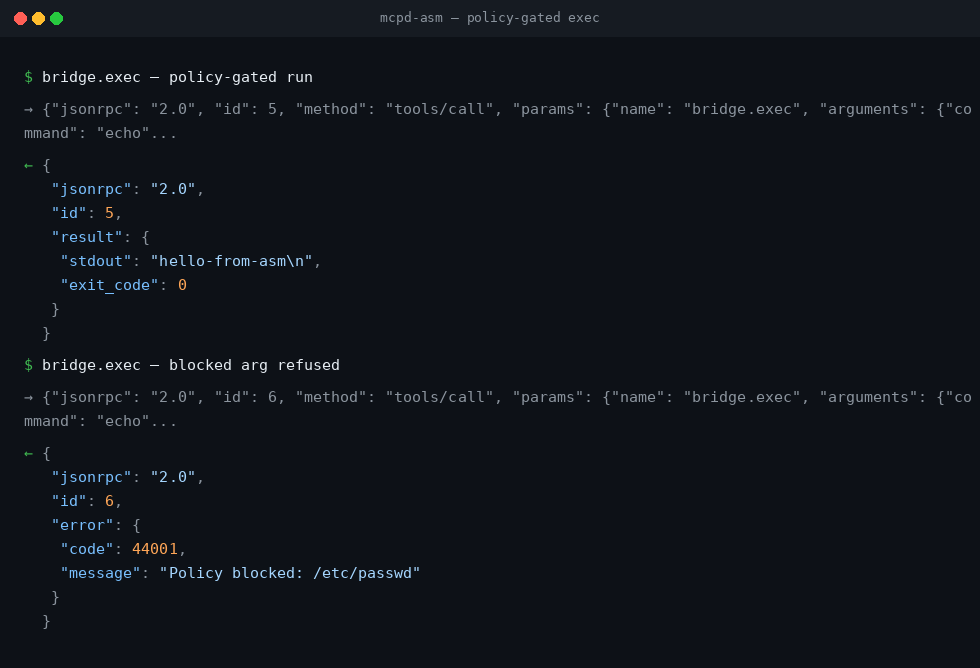

# ccgui-asm-bridge

Fork-gut of [`ahmad-parr-dev/jetbrains-cc-gui`](https://github.com/ahmad-parr-dev/jetbrains-cc-gui):
the valuable core (ai-bridge daemon protocol, channel dispatch, permission
gate, MCP handshake) rebuilt as **pure x86-64 assembly** with a **custom TCP
MCP server** and a **PyTorch harness**. No libc, no runtime — Linux syscalls
only. See `GUTTING.md` for exactly what was extracted and what was dropped.

```
ccgui-asm-bridge/
├── asm/mcpd.asm        # pure NASM x86-64: TCP listener, JSON-RPC 2.0, MCP
│                       # methods, tool registry, permission gate, gated exec
├── mcp/PROTOCOL.md     # the custom TCP transport spec
├── harness/
│   ├── harness.py      # PyTorch harness: MCP handshake, tool tests, tiny
│   │                   # classifier trained on live server responses
│   └── requirements.txt
├── GUTTING.md          # provenance: good parts in, shells out
├── Makefile
└── build/mcpd          # (generated) static binary, no dependencies
```

## Demo

Live MCP session against the assembly server (`127.0.0.1:7341`):







## Quick start

```bash
make            # assemble + link -> build/mcpd
make harness    # boots the server, runs the full MCP + torch suite, shuts down
```

Or manually:

```bash
./build/mcpd 7341 &            # TCP MCP server on 127.0.0.1:7341
python3 harness/harness.py     # PyTorch harness (needs torch, CPU is fine)
```

## Verify

`make harness` is the verification: it asserts the MCP handshake
(`protocolVersion 2024-11-05`), `tools/list`, `bridge.echo`,
`bridge.policy_check` (rewrite + block cases), `bridge.exec` (gated run +
blocked-arg refusal), error codes — then trains a tiny torch MLP on the live
responses and classifies them. Any failure exits non-zero.

## Requirements

- Linux x86-64, `nasm`, `ld`
- Python 3.10+ with `torch` (CPU wheel is fine:
  `pip install torch --index-url https://download.pytorch.org/whl/cpu`)
